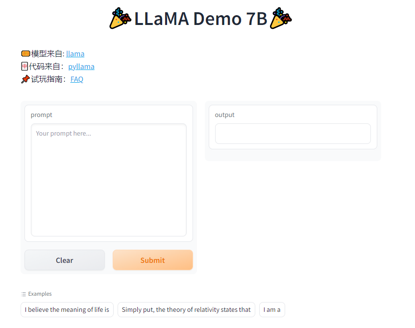

#### LLaMA Demo of 7B
- 🎟Model from: [llama](https://github.com/facebookresearch/llama)
- 🀄Code from：[pyllama](https://github.com/juncongmoo/pyllama)
- 📌FAQ：[FAQ](https://github.com/facebookresearch/llama/blob/main/FAQ.md#2)


#### Run environ
- single GPU: 16GB


#### Use
1. Download the pretrained_model.
    - BitTorrent link: `magnet:?xt=urn:btih:ZXXDAUWYLRUXXBHUYEMS6Q5CE5WA3LVA&dn=LLaMA`
    - The final directory:
        ```text
        .
        ├── inference.py
        ├── llama
        │   ├── generation.py
        │   ├── __init__.py
        │   ├── model_parallel.py
        │   ├── model_single.py
        │   └── tokenizer.py
        ├── LLaMA
        │   ├── 7B
        │   │   ├── checklist.chk
        │   │   ├── consolidated.00.pth
        │   │   └── params.json
        │   ├── tokenizer_checklist.chk
        │   └── tokenizer.model
        ├── requirements.txt
        └── webapp_single.py
        ```
2. Install the related packages.
    ```shell
    pip install -r requirements.txt
    ```
3. Run
    - Inference by scripts
        ```shell
        python inference.py
        ```
    - Run by Gradio UI
        ```shell
        python webapp_single.py
        ```

4. Gradio Result
   - Open `http://127.0.0.1:7860` to enjoy it.
    <div align="center">
        
    </div>
